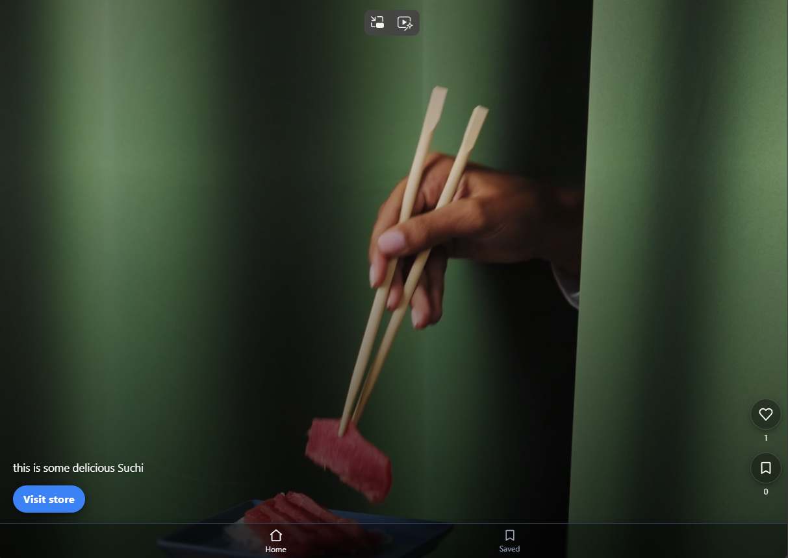

# FoodGram

A reel-based food platform built with the MERN stack. Food partners (chains, restaurants, vendors) can post short demo reels of their food items; users can view, like, save, follow partners, and learn more from partner profiles.



## Features
- Short-form video reels (upload, encode, thumbnails)
- Partner profiles (menus, location, contact, reels)
- User actions: like, save, follow, comment, share
- Search and discovery (tags, categories, trending reels)
- Auth-ready (JWT) with protected routes
- REST API + optional real-time notifications (Socket.io)
- Media storage via imagekit 

## Tech stack
- React (client) — CRA or Vite
- Node + Express (server)
- MongoDB (Mongoose)
- JWT authentication


## Prerequisites
- Node.js (LTS)
- npm or yarn
- MongoDB (local or hosted, e.g., Atlas)
- Cloud storage account (Cloudinary or AWS S3 or imagekit) recommended for media

# 📦 Packages & Tools Used

## 🔧 Backend
- **nodemon** → auto-restarts server on file changes (`npx nodemon server.js`)
- **bcryptjs** → hashing passwords
- **jsonwebtoken** → creates JWT tokens for registered/authenticated users
- **cookie-parser** → middleware to parse and save cookies (e.g., JWT tokens)
- **dotenv** → load environment variables from `.env`
- **multer** → handle file uploads (video, pdf, image, etc.)
- **@imagekit/nodejs** → cloud storage provider integration for media files
- **uuid** → generate unique names/IDs
- **express-validator / joi** → data validation for production-grade apps
- **cors** → middleware to handle CORS policy (frontend ↔ backend communication)


## ⚛️ Frontend
- **vite** → frontend build tool (`npm create vite@latest .`)
- **react-router-dom** → frontend routing
- **axios** → HTTP client (used instead of `fetch`)


Example (server/.env)
```
PORT=5000
MONGO_URI=mongodb+srv://<user>:<pass>@cluster0.mongodb.net/foodgram?retryWrites=true&w=majority
JWT_SECRET=your_jwt_secret
NODE_ENV=development

#ImageKit variables
IMAGEKIT_PUBLIC_KEY='....'
IMAGEKIT_PRIVATE_KEY=='...'
IMAGEKIT_URL_ENDPOINT='...'
```

Example (client/.env)
```
REACT_APP_API_URL=http://localhost:5000/api

```

## Installation
1. Clone the repo
```
git clone <repo-url>
cd <repo-root>
```
2. Install dependencies (root, server, client)
```
# from repo root
npm install
cd server && npm install
cd ../client && npm install
```

## Development
Run server and client concurrently:
```
# from repo root (if using concurrently)
npm run dev
```
Or run separately:
```
cd server
npm run dev

cd client
npm start
```

## Scripts (example)
- frontend
    - `npm run dev` — start client + server in development (concurrently)
    - `npm run build` — build client for production and prepare server
- backend
    - `npx nodemon server.js` — nodemon server


## Folder Structure (recommended)
```
/client         # React app (reels UI, profiles, feed)
/server         # Express app (routes, controllers, models, services)
/server/uploads # temp uploads / processing
/config         # shared config
/scripts        # helper scripts
/docker         # Dockerfiles / compose
README.md
```

## API (examples)
- Auth: POST /api/auth/user/register, POST /api/auth/food-partner/login
- Partners:  GET /api/partners/:id
- Actions: POST /api/food/like, POST /api/food/save
and So on..


Prefix API routes with /api. Keep upload handling separate (streaming, chunking, signed uploads).


## Deployment
- Will deploy very soon
- Set production env variables (MONGO_URI, JWT_SECRET, imageKit variables)


## License
Specify a license (e.g., MIT). Add LICENSE file.

## Contact
Replace with maintainer email or project link.

---
This README is a template for FoodGram. Update scripts, env variables, and folder layout to match your actual project configuration.
